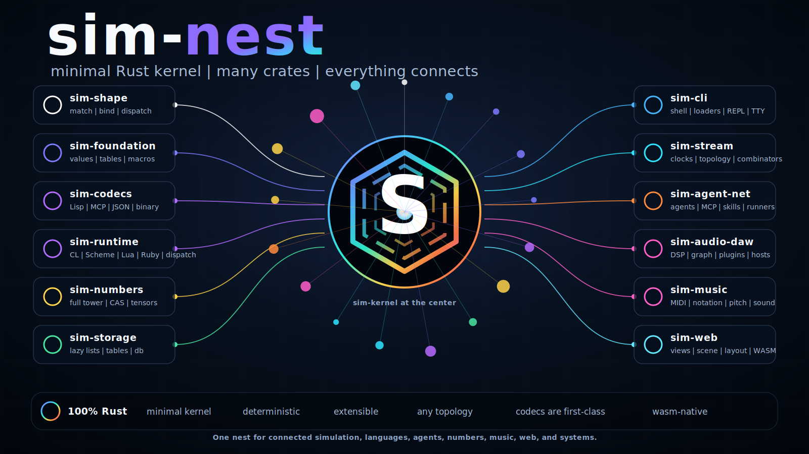
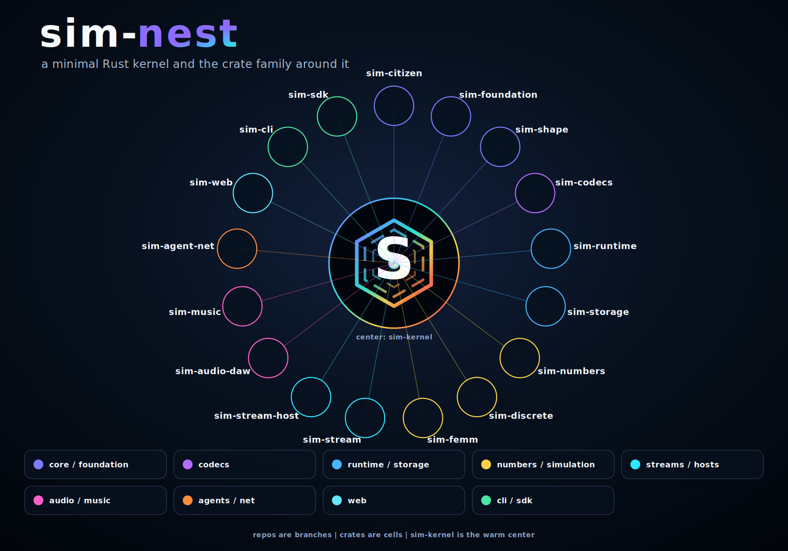

<p align="center">
  
</p>

# sim-nest

**sim-nest** is an umbrella for a minimal Rust kernel and a family of connected crates.

> Small kernel. Many crates. Everything connects.

The kernel stays small and inspectable. Languages, codecs, agents, numbers, streams,
storage, music, audio, finite-element modeling, web surfaces, and host integrations
all live as libraries around it, and every piece talks to any other through one
shared value model.

<p align="center">
  
</p>

## Documentation

New here? Start with **[sim-say](https://github.com/sim-nest/sim-say)** -- the guided
tour of the whole constellation: what SIM is, how the pieces fit, how to run it, and a
doorway into every crate's README, rustdoc, and runnable recipes.

## Shape of the nest

<!-- repos:start (generated by `sh bin/simctl repo-descriptions`; do not edit by hand) -->

| repo | what it is |
|---|---|
| [`sim-kernel`](https://github.com/sim-nest/sim-kernel) | The small, steady center that lets every SIM piece connect. |
| [`sim-run`](https://github.com/sim-nest/sim-run) | The terminal way in -- one sim command that starts a session, loads plug-ins, and answers you at a live prompt. |
| [`sim-citizen`](https://github.com/sim-nest/sim-citizen) | How a domain's own data types become first-class, well-behaved SIM values, with the wiring written for you. |
| [`sim-foundation`](https://github.com/sim-nest/sim-foundation) | The shared groundwork the rest of SIM stands on -- values, tables, macros, and the runnable lessons that teach them. |
| [`sim-shape`](https://github.com/sim-nest/sim-shape) | It is the single component that decides whether a piece of data fits a described pattern, and tells you exactly what it found inside. |
| [`sim-codecs`](https://github.com/sim-nest/sim-codecs) | One shared workshop where every SIM format reads text or bytes in and writes them straight back out. |
| [`sim-numbers`](https://github.com/sim-nest/sim-numbers) | A full tower of numbers -- everyday decimals, exact fractions, huge integers, symbolic algebra, and grids -- that all add up correctly together. |
| [`sim-storage`](https://github.com/sim-nest/sim-storage) | The places SIM keeps things -- lists and lookup tables, eager or lazy, layered or on disk. |
| [`sim-runtime`](https://github.com/sim-nest/sim-runtime) | The working machinery of a running SIM program -- names, dispatch, control, and a dozen languages to write it in. |
| [`sim-stream`](https://github.com/sim-nest/sim-stream) | The shape of changing data -- anything that moves, watched packet by packet and wired into a checked plan. |
| [`sim-stream-host`](https://github.com/sim-nest/sim-stream-host) | It plugs SIM's live streams into the real audio and MIDI gear on your machine and across your network. |
| [`sim-audio-daw`](https://github.com/sim-nest/sim-audio-daw) | A code-first audio workstation -- shape sound, patch a live signal graph, and host real plugin formats. |
| [`sim-agent-net`](https://github.com/sim-nest/sim-agent-net) | SIM as a networked host for models and agents -- tools, memory, servers, and work placed across machines. |
| [`sim-discrete`](https://github.com/sim-nest/sim-discrete) | One front door to discrete math -- algebra, counting, graphs, ranking, and spectral analysis. |
| [`sim-femm`](https://github.com/sim-nest/sim-femm) | A finite-element modeling stack that carries a drawn shape all the way to trustworthy answers. |
| [`sim-music`](https://github.com/sim-nest/sim-music) | The whole world of music in SIM -- MIDI, theory, notation, synthesis, and sound, as first-class objects. |
| [`sim-web`](https://github.com/sim-nest/sim-web) | The view and edit surface -- any value shown, edited, and committed on a canvas in the browser. |
| [`sim-sdk`](https://github.com/sim-nest/sim-sdk) | The single starting point a developer adds to reach every part of the SIM runtime. |

<!-- repos:end -->

## Design principles

- **Minimal kernel.** The center holds only shared contracts -- values, expressions,
  symbols, capabilities, events, libraries, and dispatch -- so it stays small,
  inspectable, and steady.
- **Everything else is a library.** Codecs, languages, agents, streams, views,
  numbers, audio, and solvers plug in around the kernel rather than into it.
- **Everything talks to anything.** The system is built on values, dispatch, codecs,
  streams, and adapters, not one blessed frontend.
- **Rust all the way down.** Fast, safe, concurrent, cross-platform, crate-native,
  and wasm-ready.

## Run it

New here? Run it first -- SIM is a program you run, not just a crate you build
against. Install the `sim-run` crate and it gives you the `sim` command.

<!-- runit:start (generated by `sh bin/simctl runit` from docs/site/showcase/showcase.toml; do not edit by hand) -->

```bash
cargo install sim-run                          # the thin sim bootloader
cargo install sim-nest --features serve-cli    # sim + mcp/web serve surfaces
sim --version
sim webui      # See the Web UI
sim serve mcp  # Run an MCP server
sim repl       # Start a REPL
```

<!-- runit:end -->

Full walkthrough -- what each surface shows, with runnable local fallbacks:
[sim-say](https://github.com/sim-nest/sim-say).

## Build against it (for developers)

```bash
# add the kernel, then the libraries you want
cargo add sim-kernel
cargo add sim-codec-lisp sim-lib-numbers-prelude
```

```rust
use sim_kernel::prelude::*;
```

## Explore

- Every repository carries its own README, rustdoc, and runnable recipes.
- Each crate above links to its home in the ecosystem map and the table.
- Licensed **MPL-2.0**; contributions welcome under the DCO.
